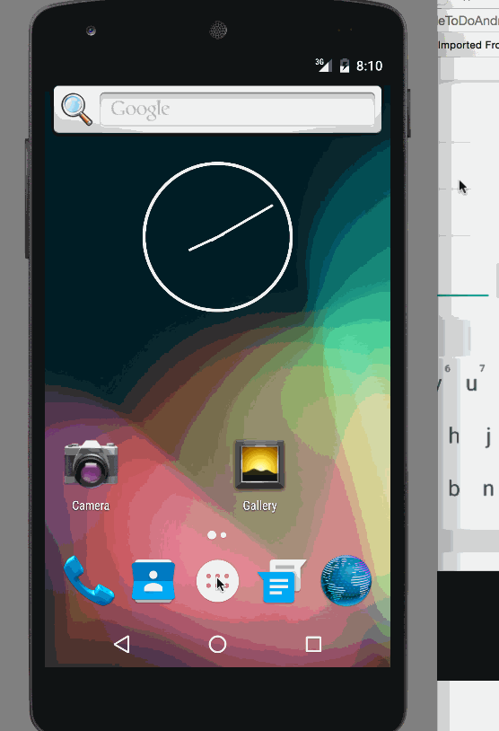

# simpleToDoAndroid
My First Android App

This is an Android demo application for maintaining a simple todo list. It supports adding new items, removing existing items and updating existing items. It persists the information in a file and reads it on startup.

Time spent: 35 hours spent in total

Completed user stories:

 * [x] Required: Add, Remove and Edit items
 * [x] Required: Persist data in a file and initialize on startup from the fle
 

Walkthrough of all user stories:

GIF created with [LiceCap](http://www.cockos.com/licecap/).

